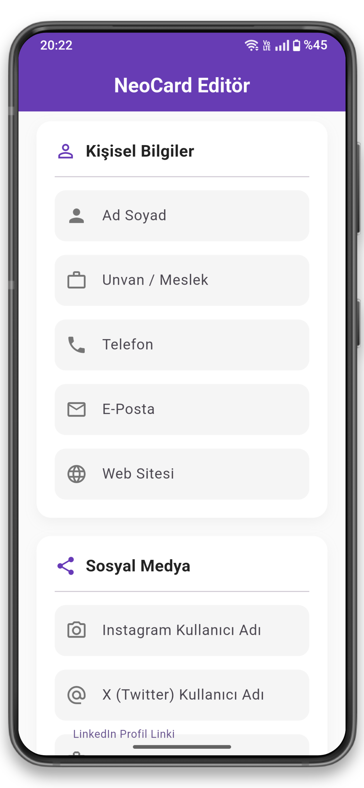
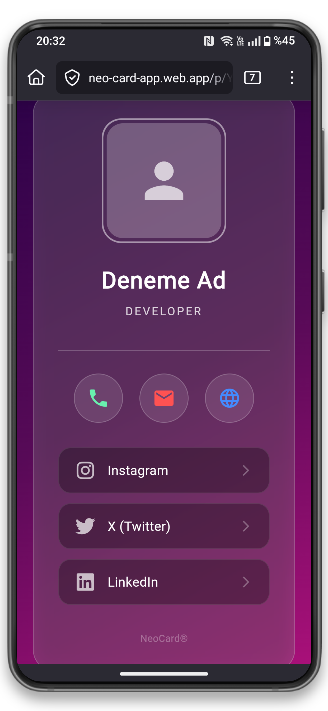

# 🪪 Neo Card


Neo Card, kullanıcıların kendi dijital kimliklerini ve profillerini fiziksel NFC kartlara (özellikle NTAG215) yazıp okuyabilmesini sağlayan, Flutter ve Firebase tabanlı modern bir mobil uygulamadır.

Fiziksel kartvizitlerin sınırlamalarını ortadan kaldırarak, verileri dijital bir profilde tutar ve sadece tek bir dokunuşla bilgilerin paylaşılmasını sağlar.

## ✨ Öne Çıkan Özellikler

- **NFC Okuma ve Yazma:** NTAG215 kartlara anında veri yazma ve okuma işlemleri.
- **Gerçek Zamanlı Veritabanı:** Firebase entegrasyonu ile kullanıcı verilerinin ve profillerinin anlık senkronizasyonu.
- **Güvenli Kimlik Doğrulama:** Firebase Auth ile hızlı ve güvenli kullanıcı giriş/çıkış işlemleri.
- **Medya Yönetimi:** Profil fotoğrafları ve diğer dosyalar için Firebase Storage entegrasyonu.
- **Çapraz Platform:** Android ve iOS cihazlarda sorunsuz çalışan akıcı arayüz.

## 🏗️ Proje Mimarisi

Proje, sürdürülebilirliği ve okunabilirliği artırmak adına katmanlı bir yapıya sahiptir:

```text
lib/
├── models/         # Veri modelleri (Örn: user_model.dart)
├── pages/          # Kullanıcı arayüzü ve ekranlar (Örn: home_page.dart, profile_view_page.dart)
├── services/       # İş mantığı ve dış entegrasyonlar
│   ├── auth_service.dart      # Kimlik doğrulama işlemleri
│   ├── database_service.dart  # Veritabanı (Firestore/Realtime DB) işlemleri
│   ├── nfc_service.dart       # NFC donanım iletişimi
│   └── storage_service.dart   # Dosya yükleme/indirme işlemleri
├── main.dart       # Uygulamanın giriş noktası
```

## 🚀 Başlarken

Projeyi kendi bilgisayarında çalıştırmak için aşağıdaki adımları izleyebilirsin.

### Gereksinimler
- [Flutter SDK](https://flutter.dev/docs/get-started/install) (Güncel sürüm)
- Firebase projesi (Google-services.json ve GoogleService-Info.plist dosyaları ayarlanmış olmalı)
- NFC destekli bir fiziksel mobil cihaz (Emülatörler NFC testleri için yetersizdir)

### Kurulum

1. Depoyu klonlayın:
   ```bash
   git clone [https://github.com/BalciAbdulkadir/Neo_Card.git](https://github.com/BalciAbdulkadir/Neo_Card.git)
   ```
2. Proje dizinine gidin:
   ```bash
   cd Neo_Card
   ```
3. Bağımlılıkları yükleyin:
   ```bash
   flutter pub get
   ```
4. Uygulamayı derleyin ve çalıştırın:
   ```bash
   flutter run
   ```
## 📱 Ekran Görüntüleri

| Mobil Uygulama) | Web Arayüzü | 
|:--------------------:|:--------------------:|
|  |  | 


## 📜 Lisans

Bu proje [Apache License 2.0](LICENSE) altında lisanslanmıştır. Daha fazla bilgi için `LICENSE` dosyasına göz atabilirsiniz.

---

# 🪪 Neo Card (English)

Neo Card is a modern mobile application built with Flutter and Firebase that enables users to read and write their digital identities and profiles onto physical NFC tags (specifically NTAG215).

By eliminating the limitations of physical business cards, it stores data in a digital profile and allows seamless information sharing with just a single tap.

## ✨ Key Features

- **NFC Read & Write:** Instant data writing and reading operations for NTAG215 cards.
- **Real-time Database:** Real-time synchronization of user data and profiles via Firebase integration.
- **Secure Authentication:** Fast and secure login/logout processes using Firebase Auth.
- **Media Management:** Firebase Storage integration for profile pictures and other media assets.
- **Cross-Platform:** Smooth UI/UX performance across both Android and iOS devices.

## 🏗️ Project Architecture

The project follows a layered architecture to ensure sustainability and readability:

```text
lib/
├── models/         # Data models (e.g., user_model.dart)
├── pages/          # UI and screens (e.g., home_page.dart, profile_view_page.dart)
├── services/       # Business logic and external integrations
│   ├── auth_service.dart      # Authentication logic
│   ├── database_service.dart  # Database (Firestore/Realtime DB) operations
│   ├── nfc_service.dart       # NFC hardware communication
│   └── storage_service.dart   # File upload/download operations
├── main.dart       # Entry point of the application
```

## 🚀 Getting Started

Follow these steps to run the project on your local machine.

### Prerequisites
- [Flutter SDK](https://flutter.dev/docs/get-started/install) (Latest version)
- Firebase Project (Configured with Google-services.json and GoogleService-Info.plist)
- Physical mobile device with NFC support (Emulators are insufficient for NFC testing)

### Installation

1. Clone the repository:
   ```bash
   git clone [https://github.com/BalciAbdulkadir/Neo_Card.git](https://github.com/BalciAbdulkadir/Neo_Card.git)
   ```
2. Navigate to the project directory:
   ```bash
   cd Neo_Card
   ```
3. Install dependencies:
   ```bash
   flutter pub get
   ```
4. Build and run the app:
   ```bash
   flutter run
   ```

## 📱 Screenshots

| Mobile App | Web Interface | 
|:--------------------:|:--------------------:|
|  |  | 


## 📜 License

This project is licensed under the [Apache License 2.0](LICENSE). For more information, please see the `LICENSE` file.
